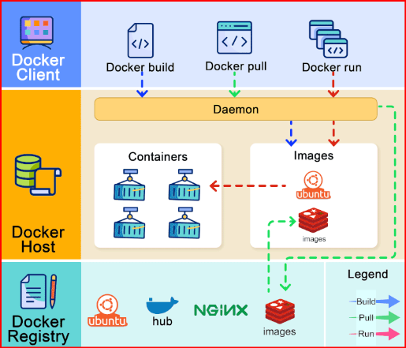
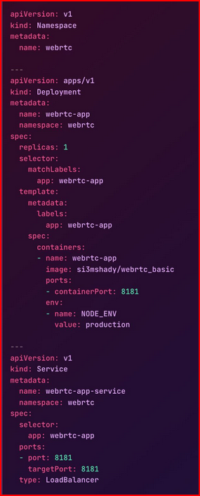

### This repository serves as a documentation of my Kubernetes (EKS & AKS) journey, focusing on my comprehension Kubernetes concepts, CI/CD, GitOps & Microservices applications.

Design/tools choices 
- Multi repo - (Github)
- GitOps - Pull-based CI/CD - (ArgoCD)
- Github Actions 
-

```
Repo structure - There are variations of mono & poly (multi) repo structure. In this project, I adopted the Poly repo structure. 

- Repo that includes EKS & AKS infrastructure deployment using terraform - https://github.com/afriteknz/k8s-infrastructure (this repo)
- Repo that includes k8s manifests - https://github.com/afriteknz/k8s-manifests 
- Repo that includes applications. [Each application has its own repo and where it makes sense, 2 different microservices can be bundled together]

```

Why I chose a poly repo structure

- Because I read these articles and many others not listed to inform. There are all opinionated so I am not going to further indulge your anxiety. I settled for a multi repo after
asking the following questions.

Questions you should ask yourself?

QQ: Should you store your #kubernetes manifests in the same repo with your application code? If you DO store them in the same repo, why?

QQ: Mono repo vs poly repo?

QQ: Branches or no branches for application release?
        - does the same team own both parts of the application/cluster. While you are thinking please read 
        - https://medium.com/@mattklein123/monorepos-please-dont-e9a279be011b
        - https://medium.com/@adamhjk/monorepo-please-do-3657e08a4b70
        - https://codefresh.io/blog/stop-using-branches-deploying-different-gitops-environments/
        - https://codefresh.io/blog/how-to-model-your-gitops-environments-and-promote-releases-between-them/
        - https://www.infracloud.io/blogs/monorepo-ci-cd-helm-kubernetes/
        - https://argo-cd.readthedocs.io/en/stable/user-guide/best_practices/
        - https://developers.redhat.com/articles/2022/09/07/how-set-your-gitops-directory-structure#directory_structures

CI/CD & GitOps

GitOps is an operating model for cloud-native applications that stores application and declarative infrastructure code in Git to be used as the source of truth for automated continuous delivery. With GitOps, you describe the desired state of your entire system in a git repository, and a GitOps operator deploys it to your environment, which is often a Kubernetes cluster. For more information 

BLUEPRINT - https://learn.microsoft.com/en-us/azure/architecture/example-scenario/gitops-aks/gitops-blueprint-aks


The example scenario in this article is applicable to businesses that want to modernize end-to-end application development by using containers, continuous integration (CI) for build, and GitOps for continuous deployment (CD). In this scenario, a Flask app is used as an example. This web app consists of a front-end written using Python and the Flask framework.

##### Architecture

Option 1 - Push-based CI/CD approaches


Push-based architecture with GitHub Actions for CI and CD.

Dataflow

This scenario covers a push-based DevOps pipeline for a two-tier web application, with a front-end web component and a back-end that uses Redis. This pipeline uses GitHub Actions for build and deployment. The data flows through the scenario as follows:

    1 - The app code is developed.
    2 - The app code is committed to a GitHub git repository.
    3 - GitHub Actions builds a container image from the app code and pushes the container image to Azure Container or Docker Registry.
    4 - A GitHub Actions job deploys, or pushes, the app, as described in the manifest files, to the Azure Kubernetes Service (AKS) cluster using kubectl or the Deploy to Kubernetes cluster action.

Option 2: Pull-based CI/CD (GitOps)


Dataflow

This scenario covers a pull-based DevOps pipeline for a two-tier web application, with a front-end web component and a back-end that uses Redis. This pipeline uses GitHub Actions for build. For deployment, it uses Argo CD as a GitOps operator to pull/sync the app. The data flows through the scenario as follows:

    1 - The app code is developed.
    2 - The app code is committed to a GitHub repository.
    3 - GitHub Actions builds a container image from the app code and pushes the container image to Azure Container Registry.
    4 - GitHub Actions updates a Kubernetes manifest deployment file with the current image version based on the version number of the container image in the Azure Container Registry.
    5 - Argo CD syncs with, or pulls from, the Git repository.
    6 - Argo CD deploys the app to the AKS cluster.

Components

    - GitHub Actions is an automation solution that can integrate with Azure services for continuous integration (CI). In this scenario, GitHub Actions orchestrates the creation of new container images based on commits to source control, pushes those images to Azure Container Registry, then updates the Kubernetes manifest files in the GitHub repository.
    - Azure Kubernetes Service (AKS) is a managed Kubernetes platform that lets you deploy and manage containerized applications without container orchestration expertise. As a hosted Kubernetes service, Azure handles critical tasks like health monitoring and maintenance for you.
    - Azure Container Registry stores and manages container images that are used by the AKS cluster. Images are securely stored, and can be replicated to other regions by the Azure platform to speed up deployment times.
    - GitHub is a web-based source control system that runs on Git and is used by developers to store and version their application code. In this scenario, GitHub is used to store the source code in a Git repository, then GitHub Actions is used to perform build and push of the container image to Azure Container Registry in the push-based approach.
    - Argo CD is an open-source GitOps operator that integrates with GitHub and AKS. Argo CD supports continuous deployment (CD). Flux could have been used for this purpose, but Argo CD showcases how an app team might choose a separate tool for their specific application lifecycle concerns, compared with using the same tool that the cluster operators use for cluster management.
    - Azure Monitor helps you track performance, maintain security, and identify trends. Metrics obtained by Azure Monitor can be used by other resources and tools, such as Grafana.

### What inspired this repo 

My journey into the world of containers and container orchestraters has been very tumultous. I started  (2010) my career in I.T in an organisation that fully embraced opensource, this meant that any solution to a problem was supposed to be solved using 
open source solutions. It was a Java shop, I worked with 3 Java developers that developed applications that we hosted on either Apache tomcat or Glassfish.
 
Challenges such as, 

- difficulty in mantaining similar environments across all developers 
- Slow shipping of applications 
- Development environments that differed from production environments 
- Manualy code deployments 

I was a Linux Administrator and I was responsible for addressing all the problems above. Unfortunately Docker wasnt a thing and the next best thing we had to solve the above problems was 

- interwoven bash scripts that were difficult to troubleshoot.
- virtualisation that sort of helped create isolated environments. 
- Intergrating Jenkins even though no one really understood how it worked completely.

2023 I was involved in an AWS EKS project where the client wanted to design a multi account/cluster solution for the customers. I have a strong background in Linux admin with its intricasies (RHCE) and between 2010 & 2023, I had played around with Podman & Docker. 

Given the complexities of containerisation and kubernetes, I decided to document my experiences. This documentation will serve as a valuable reference for all my future projects involving Kubernetes, particularly AKS and EKS.

Ultimately, my goal isn't necessarily to master every aspect of Kubernetes. Instead, I aim to understand kubernetes core fundamentals enough to be able to host microservices developed in either Java, C#, PHP, Python and any of the morden languages.

This practical approach guides my efforts, prioritizing operational effectiveness over exhaustive comprehension.

This write up will cover concepts below bulding up to a CI/CD pipeline (build, integrate and deploy an app).

    - Software development in python environment
    - Containerisation with Docker + Docker-Compose
    - Kubernetes (EKS/AKS)
    - Packaging with Helm
    - CI/CD pipeline with GitHub actions
    - GitOps with Argo CD (I will also look at flux later on)
    - Observability & Monitoring with Prometheus and Grafana
    - Infrastructure as Code with Terraform (deployment of the infrastructure)

    Additionally, I will explore 

    - Various types of supported Ingress controllers 
    - CNI plugins
    - Service mesh - Istitio


        -


#### Docker & Kubernetes - Understanding the relationship

CI/CD 


##### What is Docker and how does it work?


The diagram below shows the architecture of Docker and how it works when we run “docker build”, “docker pull” and “docker run”. 


 
There are 3 components in Docker architecture: 
 
🔹 Docker client - the docker client talks to the Docker daemon.  
🔹 Docker host - the Docker daemon listens for Docker API requests and manages Docker objects such as images, containers, networks, and volumes.  
🔹 Docker registry - A Docker registry stores Docker images. Docker Hub is a public registry that anyone can use. 
 
Let’s take the “docker run” command as an example. 
1. Docker pulls the image from the registry. 
2. Docker creates a new container. 
3. Docker allocates a read-write filesystem to the container. 
4. Docker creates a network interface to connect the container to the default network. 
5. Docker starts the container. 

Docker is a platform that enables developers to build, ship, and run applications in containers. Containers are lightweight, portable, and self-sufficient environments that encapsulate all the dependencies required to run an application.

##### Key Components:

- Docker Engine: The core component of Docker, responsible for building, running, and managing containers. It consists of:

- Docker Daemon: The background process that manages containers, images, networks, and volumes.
- Docker CLI: The command-line interface used to interact with Docker Daemon.
- Images: Read-only templates that contain the application code, runtime, libraries, dependencies, and other files required for the application to run.
- Containers: Runnable instances of Docker images. Containers isolate the application and its dependencies from the underlying infrastructure, ensuring consistency across different environments.
- Dockerfile: A text file that contains instructions for building Docker images. It specifies the base image, environment variables, dependencies, and commands needed to set up the application environment.

##### Key Concepts:

- Containerization: The process of packaging an application and its dependencies into a container. This allows the application to run consistently across different environments, from development to production.
- Layered File System: Docker uses a layered file system to optimize image builds and minimize storage space. Each instruction in a Dockerfile creates a new layer, making it possible to reuse existing layers when building new images.
- Networking: Docker provides networking capabilities to enable communication between containers and other networked services. Users can create custom networks to isolate containers or connect them to external networks.
- Volumes: Docker volumes provide persistent storage for containers. Volumes enable data to persist even after a container is stopped or deleted, making them suitable for storing application data, logs, and configuration files.

##### Use Cases:

- Application Deployment: Docker simplifies the deployment process by encapsulating applications and their dependencies into containers. This enables developers to deploy applications more efficiently and consistently across different environments.

- Microservices Architecture: Docker is well-suited for building and deploying microservices-based applications. Each microservice can be packaged into a separate container, allowing for better scalability, isolation, and maintainability.

- Continuous Integration/Continuous Deployment (CI/CD): Docker facilitates the adoption of CI/CD practices by providing a consistent environment for building, testing, and deploying applications. Docker images can be automatically built, tested, and deployed using CI/CD pipelines.

- Development Environments: Docker can be used to create lightweight, reproducible development environments. Developers can use Docker to quickly set up development environments 

#### Cloud based Kubernetes (EKS/AKS) Architectures

- Master nodes for control plane operations
- Worker nodes for executing application workloads


#### I have broken down this repo into 4 subfolders folders

##### infrastructure-eks
- Contains terraform code to deploy EKS infrastructure on AWS.

##### apps
- Contains different microservice applications in C#, Java springboot, node & Python

##### infrastructure-aks  
- Contains terraform code to deploy AKS infrastructure on Azure.

Leveraging Terraform to automate the provisioning of an Azure Kubernetes Service (AKS) cluster! 🌐💡

In this project, I focused on automating the deployment of various resources to support the AKS cluster enhancing security and isolating network resources using a Service Principal. 

The deployment unfolded in the following key steps:

- 1️⃣ Virtual Network Creation: A secure space for hosting the AKS cluster, ensuring isolation from other network resources.
- 2️⃣ Azure Container Registry: Ensuring secure and private container image management.
- 3️⃣ Azure Key Vault: A centralized vault to securely store sensitive information like client secrets.
- 4️⃣ AKS Cluster Setup: Configuration of nodes for running containerized applications, with specifications defined using 


##### Understanding Kubernetes components - the details.


###### Namespaces 


In Kubernetes, #namespaces are the linchpin for organizing and securing resources within a unified cluster, crucial for upholding structure and safeguarding data in multi-tenancy setups.

Multi-tenancy where each customer is running the same instance of a vendor application, although the data being used in the app is completed isolated from other. 

In this example, 

by changing the namespaces within the #Kubernetes manifest, different instances of an application can be deployed, ensuring that each tenant operates within their own isolated environment or domain, effectively managing resources and maintaining security in a multi-tenancy setup.

###### Performance optimization is all about three things

1. Cost Optimization
2. Kubernetes Resource Optimization
3. Worker Node Optimization